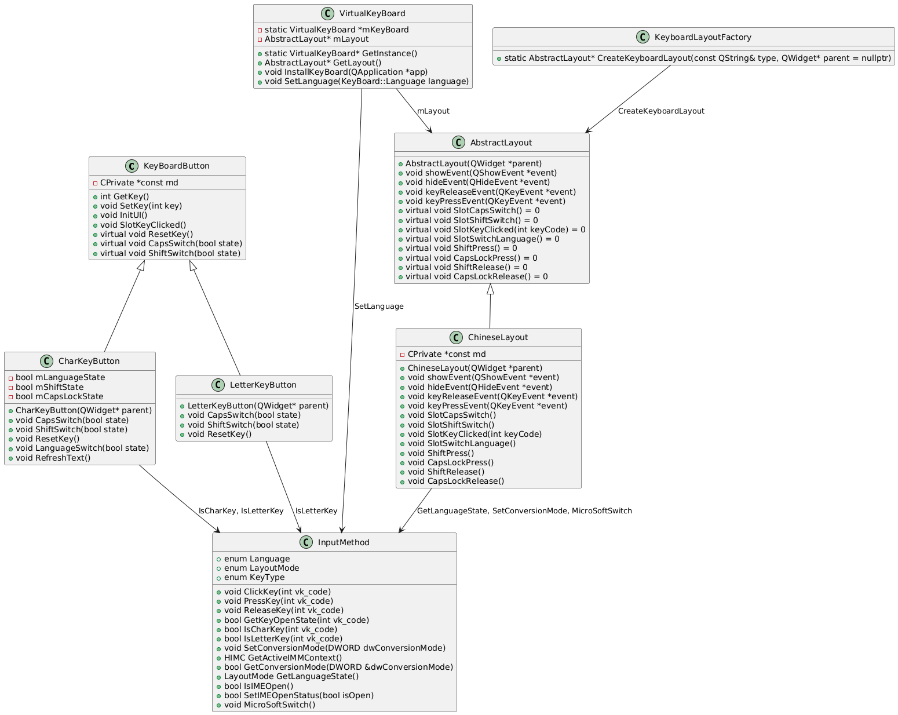

### 目前demo功能

1.	中英文键盘按键输入，包括字符 A-Z，数字0-9，以及；字符等。
2.	调用系统输入法（微软拼音）。
3.	中英文切换状态与输入法匹配，输入法显示中文时键盘有提示。
4.	`Shift`长按模式，在`Shift`长按状态下键盘布局会进行改变，如小写变为大写，数字按键区显示字符，字符区显示次选字符。
5.	`CapsLock`大小写切换，切换时会调整键盘字母显示布局。
6.	中英文、`Shift`、`CapsLock`组合显示，不同的组合键盘布局会有所不同。
7.	功能按键：全选、切换输入法、中英文切换等。
8.	输入焦点发生改变时计算位置并弹出软键盘。

### TODO:

1.	键盘输入同步到软键盘。如键盘按下`Shift`，是否需要软键盘也做出对应显示。
2.	不通过系统输入法直接输入的小键盘、数字键盘、符号键盘。
3.  多语言布局控制（根据系统给出默认值，允许通过配置文件自定义）。
4.  键盘呼出的位置对输入框形成了遮挡,用户看不见输入的内容 如何处理。
5.  失去焦点的时候隐藏键盘。


### 类说明




1. **按键基类**
   - **KeyBoardButton** (`keyboardbutton.h`, `keyboardbutton.cpp`)
     - 继承自 `QPushButton`。
     - 提供基本的按键功能，如设置按键码、处理按键按下和释放事件。
     - 包含 `CPrivate` 类，用于封装私有成员和方法。
     - 提供 `CapsSwitch` 和 `ShiftSwitch` 方法，用于处理大小写和字符切换。
     ```cpp
     class KeyBoardButton : public QPushButton {
     public:
         int GetKey();
         void SetKey(int key);
         void InitUI();
         void SlotKeyClicked();
         virtual void ResetKey();
         virtual void CapsSwitch(bool state);
         virtual void ShiftSwitch(bool state);
     private:
         CPrivate *const md;
     };
     ```

2. **字符按键类**
   - **CharKeyButton** (`charkeybutton.h`, `charkeybutton.cpp`)
     - 继承自 `KeyBoardButton`。
     - 专门处理字符按键，如字母和数字。
     - 提供 `CapsSwitch`、`ShiftSwitch`、`ResetKey` 和 `LanguageSwitch` 方法，用于处理按键的大小写、字符切换和语言切换。
     - 使用 `InputMethod` 命名空间中的方法进行字符转换和输入法状态管理。
     ```cpp
     class CharKeyButton : public KeyBoardButton {
     public:
         CharKeyButton(QWidget* parent);
         void CapsSwitch(bool state);
         void ShiftSwitch(bool state);
         void ResetKey();
         void LanguageSwitch(bool state);
         void RefreshText();
     private:
         bool mLanguageState;
         bool mShiftState;
         bool mCapsLockState;
     };
     ```

3. **字母按键类**
   - **LetterKeyButton** (`letterkeybutton.h`, `letterkeybutton.cpp`)
     - 继承自 `KeyBoardButton`。
     - 专门处理字母按键。
     - 提供 `CapsSwitch`、`ShiftSwitch` 和 `ResetKey` 方法，用于处理字母按键的大小写切换。
     - 使用 `InputMethod` 命名空间中的方法进行输入法状态管理。
     ```cpp
     class LetterKeyButton : public KeyBoardButton {
     public:
         LetterKeyButton(QWidget* parent);
         void CapsSwitch(bool state);
         void ShiftSwitch(bool state);
         void ResetKey();
     };
     ```

4. **抽象键盘布局类**
   - **AbstractLayout** (`abstractlayout.h`, `abstractlayout.cpp`)
     - 抽象基类，定义了键盘布局的基本接口。
     - 包含纯虚函数，要求子类实现具体的布局和按键管理功能。
     ```cpp
     class AbstractLayout : public QWidget {
     public:
         AbstractLayout(QWidget *parent);
         void showEvent(QShowEvent *event);
         void hideEvent(QHideEvent *event);
         void keyReleaseEvent(QKeyEvent *event);
         void keyPressEvent(QKeyEvent *event);
         virtual void SlotCapsSwitch() = 0;
         virtual void SlotShiftSwitch() = 0;
         virtual void SlotKeyClicked(int keyCode) = 0;
         virtual void SlotSwitchLanguage() = 0;
         virtual void ShiftPress() = 0;
         virtual void CapsLockPress() = 0;
         virtual void ShiftRelease() = 0;
         virtual void CapsLockRelease() = 0;
     };
     ```

5. **中文键盘布局类**
   - **ChineseLayout** (`chineselayout.h`, `chineselayout.cpp`)
     - 继承自 `AbstractLayout`。
     - 实现了具体的中文键盘布局和按键管理功能。
     ```cpp
     class ChineseLayout : public AbstractLayout {
     public:
         ChineseLayout(QWidget *parent);
         void showEvent(QShowEvent *event);
         void hideEvent(QHideEvent *event);
         void keyReleaseEvent(QKeyEvent *event);
         void keyPressEvent(QKeyEvent *event);
         void SlotCapsSwitch();
         void SlotShiftSwitch();
         void SlotKeyClicked(int keyCode);
         void SlotSwitchLanguage();
         void ShiftPress();
         void CapsLockPress();
         void ShiftRelease();
         void CapsLockRelease();
     private:
         CPrivate *const md;
     };
     ```

6. **虚拟键盘类**
   - **VirtualKeyBoard** (`virtualkeyboard.h`, `virtualkeyboard.cpp`)
     - 单例模式，负责虚拟键盘的全局管理和显示。
     - 包含一个 `AbstractLayout` 对象，用于管理键盘布局。
     - 提供 `InstallKeyBoard` 方法，用于安装虚拟键盘并监听输入焦点变化。
     ```cpp
     class VirtualKeyBoard {
     public:
         static VirtualKeyBoard* GetInstance();
         AbstractLayout* GetLayout();
         void InstallKeyBoard(QApplication *app);
         void SetLanguage(KeyBoard::Language language);
     private:
         static VirtualKeyBoard *mKeyBoard;
         AbstractLayout* mLayout;
     };
     ```

7. **键盘布局工厂类**
   - **KeyboardLayoutFactory** (`keyboardlayoutfactory.h`, `keyboardlayoutfactory.cpp`)
     - 工厂类，用于创建不同类型的键盘布局对象。
     ```cpp
     class KeyboardLayoutFactory {
     public:
         static AbstractLayout* CreateKeyboardLayout(const QString& type, QWidget* parent = nullptr);
     };
     ```

8. **输入法接口管理**
   - **InputMethod** (`inputmethod.h`, `inputmethod.cpp`)
     - 提供输入法相关的功能，如模拟按键、获取和设置输入法状态。
     - 包含 `ClickKey`、`PressKey`、`ReleaseKey`、`GetKeyOpenState`、`IsCharKey`、`IsLetterKey` 等方法。
     - 包含 `GetActiveIMMContext`、`GetConversionMode`、`SetConversionMode`、`GetLanguageState`、`IsIMEOpen`、`SetIMEOpenStatus` 和 `MicroSoftSwitch` 等方法，用于管理输入法的状态和切换。
     ```cpp
     class InputMethod {
     public:
         enum Language { ENGLISH, CHINESE };
         enum LayoutMode { QWERTY, ABC };
         enum KeyType { CHARACTER, LETTER };

         void ClickKey(int vk_code);
         void PressKey(int vk_code);
         void ReleaseKey(int vk_code);
         bool GetKeyOpenState(int vk_code);
         bool IsCharKey(int vk_code);
         bool IsLetterKey(int vk_code);
         void SetConversionMode(DWORD dwConversionMode);
         HIMC GetActiveIMMContext();
         bool GetConversionMode(DWORD &dwConversionMode);
         LayoutMode GetLanguageState();
         bool IsIMEOpen();
         bool SetIMEOpenStatus(bool isOpen);
         void MicroSoftSwitch();
     };
     ```


### 类图说明

1. **KeyBoardButton** 是一个基类，继承自 `QPushButton`，提供基本的按键功能。
2. **CharKeyButton** 和 **LetterKeyButton** 分别继承自 **KeyBoardButton**，分别处理字符按键和字母按键。
3. **AbstractLayout** 是一个抽象基类，定义了键盘布局的基本接口。
4. **ChineseLayout** 继承自 **AbstractLayout**，实现了具体的中文键盘布局和按键管理功能。
5. **VirtualKeyBoard** 是一个单例类，负责虚拟键盘的全局管理和显示，包含一个 `AbstractLayout` 对象用于管理键盘布局。
6. **KeyboardLayoutFactory** 是一个工厂类，用于创建不同类型的键盘布局对象。
7. **InputMethod** 提供与windows输入法相关的功能，与 `CharKeyButton` 和 `LetterKeyButton` 交互以处理输入状态。
